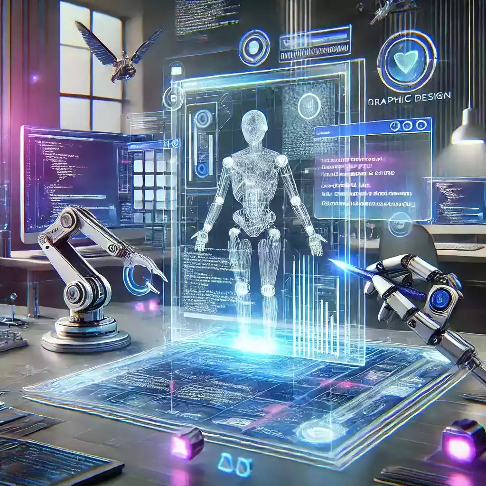

---

## Introduction
Artificial Intelligence (AI) has rapidly become a buzzword in various industries, and web design is no exception. From automating tasks to analyzing user behavior, AI is transforming the way websites are built and managed. But how does it benefit small businesses? What are the risks involved? And what ethical dilemmas do we need to consider? In this post, we will explore these questions and offer valuable insights tailored for small business owners.

---

## What is Artificial Intelligence?
Artificial Intelligence refers to the simulation of human intelligence in machines designed to think and learn like humans. This technology can perform tasks that usually require human intelligence, such as visual perception, speech recognition, decision-making, and language translation.

---

## How AI is Transforming Web Design

### 1. Automation

One of the most significant benefits of AI in web design is automation. AI-powered tools can handle repetitive tasks like coding, testing, and even content creation. This frees up time for designers to focus on more complex tasks that require creativity and problem-solving skills.

- **Example:** Wiz, an AI website builder, simplifies web design by creating tailor-made designs based on user preferences【4:0†source】.

### 2. Improved User Experience

AI can analyze user behavior to make websites more intuitive and user-friendly. By understanding how users interact with a website, AI can suggest changes to layout, design, and content to improve the overall user experience.

- **Example:** Tools like Crazy Egg can track where users click, scroll, and engage the most on your webpage【4:0†source】.

### 3. Personalization

Personalization is another area where AI excels. AI algorithms can analyze user data to deliver personalized content and recommendations, making each visitor feel like the website was designed just for them.

- **Example:** Netflix uses AI to recommend movies and shows based on your viewing history, making it more likely that you'll find something you'll enjoy.

---

## The Benefits for Small Businesses

### 1. Cost-Effective Solutions

Using AI technology can lower the costs of web design by automating tasks that would otherwise require manual labor. This is especially advantageous for small businesses that may not have large budgets.

### 2. Scalability

AI tools can be easily scaled as your business grows. Whether you need to add more features, improve your SEO rankings, or enhance user experience, AI solutions can adapt to your changing needs.

### 3. Data-Driven Decisions

AI can analyze vast amounts of data quickly and efficiently, providing insights that can help in making informed business decisions. This is crucial for small businesses that need to be agile and responsive to market trends.

---

## Risks Involved

### 1. Privacy Concerns

AI requires a lot of data to function effectively. This raises privacy concerns, especially when it comes to user data. Small businesses need to ensure that they are compliant with data protection laws and ethical guidelines.

### 2. Job Displacement

Automation can lead to job displacement, particularly in roles that involve repetitive tasks. Small business owners must consider the impact on their employees and explore ways to retrain staff for new roles.

### 3. Reliability Issues

Over-reliance on AI can be risky. If the AI system fails, it can lead to significant downtime or errors. It's essential to have human oversight to ensure that everything runs smoothly.

---

## Ethical Dilemmas

### 1. Bias in AI

AI algorithms can sometimes be biased, reflecting the prejudices present in the training data. This can lead to unfair treatment of certain groups of people. Small businesses must be vigilant in ensuring that their AI tools are fair and unbiased.

### 2. Transparency

Transparency is crucial when using AI. Customers should know when they are interacting with a machine rather than a human. This builds trust and ensures ethical interactions.

### 3. Accountability

Who is responsible when AI makes a mistake? This is a complex question that touches on the ethical use of AI. Business owners need to be clear about accountability to maintain customer trust and ethical standards.

---

## Conclusion
The future of AI in web design is promising, offering numerous benefits like automation, improved user experience, and personalization, especially for small businesses. However, it's crucial to be aware of the risks and ethical dilemmas to ensure responsible use of this powerful technology.

By leveraging AI responsibly, small businesses can stay competitive, offer exceptional user experiences, and make data-driven decisions. Always remember, the key to successful AI integration lies in balancing technology with human oversight.

---
